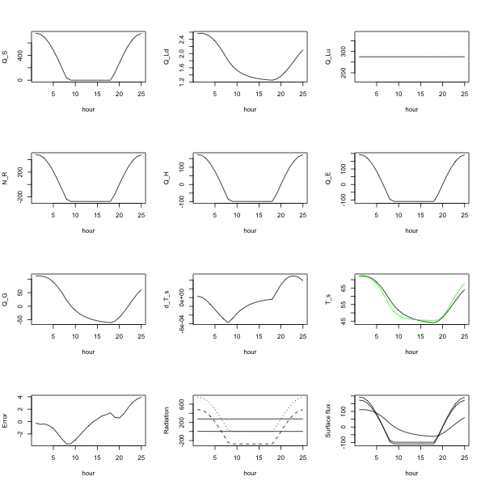

# ParametricWeatherModel


ParametricWeatherModel is a repository for forecasting surface temperature
based primarily on latitude, longitude, day of year and hour of day.

If you like ParametricWeatherModel, give it a star, or fork it and contribute!


## Development Stage

The repository is slowly maturing.  It contains some
limitations, hardcoded parameters and possibly errors.  Please file an
issue if you find a problem.


## Usage

Predict surface temperature at specified latitude, longitude, day of year,
ground temperature and initial surface temperature:
```sh
# Using short options
python parametric_scheme.py -la 47.6928 -lo -122.3038 -da 229 -gt 54 -st 72 -pr 0.2

# The same using long options
python parametric_scheme.py --latitude 47.6928 --longitude -122.3038 --day_of_year 229 --ground_temp 54 --surface_temp 72 --percent_net_radiation 0.2

# To list all command line options
python parametric_scheme.py -h
```


## Installation

Requires a recent version of python (either 2 or 3 should work).

The following should work on any unix-ish environment:
```sh
wget https://raw.githubusercontent.com/makeyourownmaker/ParametricWeatherModel/master/parametric_scheme.py
python parametric_scheme.py -h
```


## Details

This repository contains code for a simple parameterization scheme to
forecast the air temperature at the surface at a point over the next hour.
It is based on chapter 2 from the book
[Parameterization Schemes: Keys to Understanding Numerical Weather Prediction Models](https://www.cambridge.org/core/books/parameterization-schemes/C7C8EC8901957314433BE7C8BC36F16D#fndtn-information)
by [David J. Stensrud](http://www.met.psu.edu/people/djs78).

According to [wikipedia](https://en.wikipedia.org/wiki/Parametrization_(atmospheric_modeling)):
A parameterization scheme "in a weather or climate model in the context of
numerical weather prediction is a method of replacing processes that are too
small-scale or complex to be physically represented in the model by a
simplified process."  The obvious risk with this approach is producing an
over-determined model.

The python code models the following radiative processes:
  * Incoming solar radiation
  * Upwelling longwave radiation from the surface
  * Downwelling longwave radiation from the atmosphere
  * Ground heat flux (heat transfer from the ground surface into the deeper soil levels)
  * Sensible heat flux (heat transfer per unit area from the ground to the atmosphere)
  * Latent heat flux (rate of moisture transfer per unit area from the ground surface to the atmosphere)

There are two options for calculating the sensible heat flux:
  1) The default method uses percent of net radiation ( --percent_net_radiation )
  2) The experimental method uses resistance to heat flux ( --resistance )

To use the experimental method the percent of net radiation must be set to 0:
```sh
# Using short options
python parametric_scheme.py -la 47.6928 -lo -122.3038 -da 229 -gt 54 -st 72 -pr 0 -rh 1000

# The same using long options
python parametric_scheme.py --latitude 47.6928 --longitude -122.3038 --day_of_year 229 --ground_temp 54 --surface_temp 72 --percent_net_radiation 0 --resistance 1000
```

Equation and page numbers in the python code refer to
[Parameterization Schemes: Keys to Understanding Numerical Weather Prediction Models](https://doi.org/10.1017/CBO9780511812590)
by [David J. Stensrud](http://www.met.psu.edu/people/djs78).

The local hour of the sun approximation is from:
[pveducation.org](https://www.pveducation.org/pvcdrom/properties-of-sunlight/solar-time)

### Parameters

Included parameters:
  * Required:

| Name                  | Short | Long                    | Description                                | Default |
|-----------------------|-------|-------------------------|--------------------------------------------|---------|
| Latitude              | -la   | --latitude              | -90 to 90; plus for north, minus for south | N/A     |
| Longitude             | -lo   | --longitude             | -180 to 180; plus for east, minus for west | N/A     |
| Day                   | -da   | --day_of_year           | Julian day of year; 1 to 365               | N/A     |
| Surface temperature   | -st   | --surface_temp          | Initial surface air temperature (F or C)   | N/A     |
| Ground temperature    | -gt   | --ground_temp           | Ground reservoir temperature (F or C)      | N/A     |
| Percent net radiation | -pr   | --percent_net_radiation | Percent net radiation (0 to 1)             | N/A     |

  * Optional parameters:

| Name                               | Short | Long                  | Description                                                                    | Default             |
|------------------------------------|-------|-----------------------|--------------------------------------------------------------------------------|---------------------|
| Hour                               | -ho   | --hour                | Hour of day; 0 to 24                                                           | 12                  |
| Albedo                             | -al   | --albedo              | Albedo; 0 to 1                                                                 | 0.3                 |
| Cloud fraction                     | -cf   | --cloud_fraction      | Cloud fraction; 0 to 1                                                         | 0                   |
| Solstice                           | -ds   | --day_of_solstice     | Day of solstice; 172 or 173                                                    | 173                 |
| UTC offset                         | -uo   | --utc_offset          | UTC offset in hours; -12 to 12                                                 | 0                   |
| Forecast period                    | -fp   | --forecast_period     | Forecast period in seconds; 600 to 3600                                        | 3600                |
| Transmissivity                     | -tr   | --transmissivity      | Atmospheric transmissivity; greater than 0                                     | 0.8                 |
| Emissivity                         | -em   | --emissivity          | Surface emissivity; 0.9 to 0.99                                                | 0.95                |
| Bowen ratio                        | -br   | --bowen_ratio         | Bowen ratio; -10 to 10                                                         | 0.9                 |
| Precipitable water                 | -pw   | --precip_water        | Precipitable water in cm; greater than 0                                       | 1.0                 |
| Resistance to heat flux            | -rh   | --resistance          | EXPERIMENTAL Resistance to heat flux (m s^-1)                                  | 0                   |
| Cloud temperature adjustment       | -tc   | --cloud_temp_adjust   | EXPERIMENTAL Temperature of the base of the cloud adjustment (Kelvin)          | 0                   |
| Cloud temperature constant         | -ct   | --cloud_temp_constant | EXPERIMENTAL Temperature of the base of the cloud constant (Fahrenheit)        | Surface temperature |
| Atmospheric temperature adjustment | -ta   | --atmos_temp_adjust   | EXPERIMENTAL Air temperature at 40 hPa above the surface adjustment (Kelvin)   | 0                   |
| Atmospheric temperature constant   | -at   | --atmos_temp_constant | EXPERIMENTAL Air temperature at 40 hPa above the surface constant (Fahrenheit) | Surface temperature |
| File name                          | -fn   | --filename            | File name for comma separated value output                                     | N/A                 |
| Help                               | -h    | --help                | Show this help message and exit                                                | N/A                 |
| Verbose                            | -v    | --verbose             | Print additional information                                                   | N/A                 |

Note:
 * Temperatures in Fahrenheit are converted to Kelvin in the script
 * The cloud fraction and cloud base temperature options are largely untested
 * Both the atmospheric and cloud temperatures default to the surface temperature value unless otherwise specified
 * Ground and surface temperature range checks start at -150 F and end at 150 F
   * This wide range of input values may not be compatible with all the parameterization scheme assumptions
   * This range still applies if temperatures are specified in Celsius

The atmospheric temperature adjustment equals the surface temperature plus/minus argument degrees Kelvin.
Similarly for the cloud temperature adjustment.  These two options are intended to provide a simple method
to vary these temperatures over a 24 hour period as shown in the comparison section below.  This simple
approach is not suggested in the Parameterization Schemes book.


Constants used:

**Note**: Strictly speaking some of these values are not constants; meaning constant values have been used as simpliying approximations.

| Constant                                     | Value           | Unit             | Simpliying approximation |
|----------------------------------------------|-----------------|------------------|--------------------------|
| Stefan-Boltzmann                             | 5.67 * 10**(-8) | W m^-2 K^-4      | No                       |
| Thermal conductivity of air                  | 2.5 * 10**(-2)  | W m^-1 K^-1 s^-1 | No                       |
| Solar irradiance                             | 1368            | W m^-2           | No                       |
| Soil heat capacity                           | 1.4 * 10**5     | J m^-2 K^-1      | Yes                      |
| Thermal diffusivity of air                   | 11              | J m^-2 K^-1 s^-1 | Yes                      |
| Specific heat at constant pressure           | 1004            | J K^-1 kg^-1     | No                       |
| Density of air at sea level and 15 degrees C | 1.225           | kg m^-3          | No                       |

### Comparison with Madaus

Predictions from Luke Madaus
[Digging into a "simple" weather model](http://lukemweather.blogspot.com/2011/08/digging-into-simple-weather-model.html)
can be used for comparison with my implementation.

Madaus does not provide source code and the explanation is terse.
I suspect not all of the parameters involved nor necessary
assumptions have been listed.  Also, I may have used a different
local hour of the sun approximation and atmospheric temperature
ajustment.  So, I would not expect identical results.  The final
T_S plot below shows reasonable agreement between the Madaus
predictions and mine for surface temperature
(RMSE is approximately 2.05).  Madaus results are plotted in green.
I am not a meteorologist, so I am not certain all the results are
reasonable.
Anecdotally, the downwelling radiation (Q_Ld) predictions seem low.



The plots are in order from left to right and top to bottom:

| Variable     | Description                                  |
|--------------|----------------------------------------------|
| Q_S          | Solar radiation                              |
| Q_Ld         | Downwelling radiation                        |
| Q_Lu         | Upwelling radiation                          |
| N_R          | Net radiation (Q_S + Q_Ld - Q_Lu)            |
| Q_H          | Sensible heat flux                           |
| Q_E          | Latent heat flux                             |
| Q_G          | Ground heat flux                             |
| d_T_s        | Change in surface temperature                |
| T_s          | Surface temperature                          |
| Error        | Difference between my predictions and Madaus |
| Radiation    | Q_S (dotted) , Q_Ld, Q_Lu, N_R (dashed)      |
| Surface flux | Q_H, Q_E, Q_G                                |

To recreate the results above start with the following command line parameters:
```sh
# Using short options
python parametric_scheme.py -la 47.6928 -lo -122.3038                \
                            -da 229 -ho 13                           \
                            -gt 54 -st 72                            \
                            -uo -8 -pw 1.27                          \
                            -al 0.1147677                            \
                            -em 0.7314196                            \
                            -tr 0.7736024                            \
                            -pr 0.3595031                            \
                            -ta 12.2507737                           \
                            -de F

# The same using long options
python parametric_scheme.py --latitude 47.6928 --longitude -122.3038  \
                            --day_of_year 229 --hour 13               \
                            --ground_temp 54 --surface_temp 72        \
                            --utc_offset -8 --precip_water 1.27       \
                            --albedo 0.1147677                        \
                            --emissivity 0.7314196                    \
                            --transmissivity 0.7736024                \
                            --percent_net_radiation 0.3595031         \
                            --atmos_temp_adjust 12.2507737            \
                            --degrees F
```
The surface temperature prediction should then be used as the -st/--surface_temp
argument and the -ho/--hour argument should be incremented by 1.

The --albedo, --emissivity, --transmissivity, --percent_net_radiation and --atmospheric_temp
arguments used above were produced from an optimisation process over the full 24 hour
forecast period.  The optimisation process minimised temperature difference with Madaus
predictions.  A multi-objective optimisation process, considering also some of the
radiative processes, may give more realistic results.
I am not a meteorologist, so I am not certain this combination of values is reasonable.

The default cloud fraction (0) and Bowen ratio (0.9) have been used.

### CSV output

The --fn and --filename options specify a file to output the following variables
to:

| Variable | Description                   |
|----------|-------------------------------|
| Q_S      | Solar radiation               |
| Q_Ld     | Downwelling radiation         |
| Q_Lu     | Upwelling radiation           |
| Q_H      | Sensible heat flux            |
| Q_E      | Latent heat flux              |
| Q_G      | Ground heat flux              |
| d_T_s    | Change in surface temperature |
| T_s      | Surface temperature           |

These variables are separated by tabs.

### Limitations and assumptions

  * A host of atmospheric factors are ignored: refraction, humidity, pressure, wind, rain, snow, pollution etc
  * A host of geographic factors are ignored: elevation, slope of terrain, soil type, soil moisture, vegetation etc
  * Hardcoded parameters in the script:
    * Soil heat capacity will vary with soil type etc
    * Thermal diffusivity of air is affected by temperature, pressure etc
    * Thermal conductivity of air is affected by temperature, pressure etc
    * Solar constant may be influenced by sunspot activity
    * Table A7 in [lecture 10 of AS547](https://atmos.washington.edu/~breth/classes/AS547/lect/lect10.pdf)
      from [Chris Bretherton](https://atmos.washington.edu/~breth/) gives thermal conductivity, thermal 
      diffusivity and specific heat values for various surfaces
  * Results for downwelling radiation are questionable:
    * Assumes temperature at 40 hPa above the ground surface equals surface
      temperature which it certainly does not
    * Results for non-zero cloud fraction are questionable:
      * Assumes temperature at the base of the cloud equals surface
        temperature which it certainly does not
  * Ground and surface temperature range checks start at -150 F and end at 150 F
    * This wide range of input values may not be compatible with all the parameterization scheme assumptions
  * Will not work over water, snow ...


## Roadmap

* Perform sanity checks:
  * Starting with [Luke Madaus examples](http://lukemweather.blogspot.com/2011/08/digging-into-simple-weather-model.html)
    * Check if downwelling radiation is too low in the later hours
  * Sensible heat flux increases during morning reaching a maximum in the
    afternoon before decreasing to zero after sunset on cloudless summer days
  * Surface energy budget should balance - Equation 2.102  Page 55
    * Sensible heat flux (Q_H), latent heat flux (Q_E) and ground heat flux (Q_G)
      should be positive with high solar radiation (Q_S)
  * Find recent local weather examples for comparison
  * Find examples from the literature for comparison

* Add unit tests:
  * Setup travis CI
  * Find range of test cases where surface temperature and all parameters are known
    * Examples from the literature for each of the heat fluxes
      * Preferably observations
  * What is an acceptable prediction interval?

* Improve command line options:
  * Improve argparse range checks:
    * Ensure consistency between different temperature range checks

* Expand documentation:
  * Justify values used in command line argument range checks

* Explore sensitivity analysis:
  * It would be interesting (but possibly overkill) to look at
    [how uncertainty in the inputs affects the model predictions](https://en.wikipedia.org/wiki/Sensitivity_analysis)


## Contributing

Pull requests are welcome.  For major changes, please open an issue first to discuss what you would like to change.


## See also

* [Digging into a "simple" weather model](http://lukemweather.blogspot.com/2011/08/digging-into-simple-weather-model.html)
  by [Luke Madaus](http://midlatitude.com/lukemadaus/)
* [Parameterization Schemes: Keys to Understanding Numerical Weather Prediction Models](https://doi.org/10.1017/CBO9780511812590)
  by [David J. Stensrud](http://www.met.psu.edu/people/djs78)
* The [ESCOMP repositories](https://github.com/ESCOMP) particularly the Community Land Model included in
  [CTSM](https://github.com/ESCOMP/ctsm) which has detailed
  [radiative flux](https://escomp.github.io/ctsm-docs/doc/build/html/tech_note/Radiative_Fluxes/CLM50_Tech_Note_Radiative_Fluxes.html)
  and
  [heat flux](https://escomp.github.io/ctsm-docs/doc/build/html/tech_note/Fluxes/CLM50_Tech_Note_Fluxes.html#sensible-and-latent-heat-fluxes-for-non-vegetated-surfaces)
  calculations
* Table 10.1 in [lecture 10 of AS547](https://atmos.washington.edu/~breth/classes/AS547/lect/lect10.pdf)
  from [Chris Bretherton](https://atmos.washington.edu/~breth/) gives albedo and emissivity values for
  a range of natural surfaces
* [Radiation balance](http://www.indiana.edu/~geog109/topics/04_radiation/4c-RadiationBalance_nf.pdf)
  is discussed by Constance Brown on the G109 course
* [Local hour of the sun approximation](https://www.pveducation.org/pvcdrom/properties-of-sunlight/solar-time)
  from [pveducation.org](https://www.pveducation.org/)

* My related weather repositories:
  * [Cambridge Temperature Forecasts](https://github.com/makeyourownmaker/CambridgeTemperatureModel)
  * [Cambridge University Computer Laboratory Weather Station R Shiny Web App](https://github.com/makeyourownmaker/ComLabWeatherShiny)

## License
[GPL-2](https://www.gnu.org/licenses/old-licenses/gpl-2.0.en.html)
